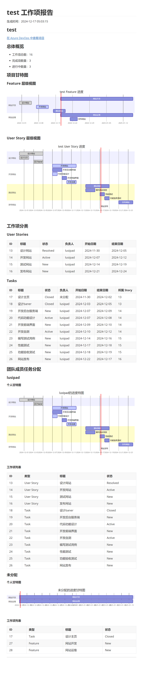

# Azure2Md

[English](README.en.md) | [简体中文](README.md)

A tool to export Azure DevOps/TFS work items to Markdown reports.

## Features

- Support for Azure DevOps and TFS 2022
- Support for both HTTPS and HTTP connections
- Support for multiple project work item export
- Support for merged or individual project reports
- Support for complete work item hierarchy (Feature -> User Story -> Task)
- Generate multi-level Gantt chart views
  - Feature + User Story view
  - User Story + Task view
- Group tasks by team members
- Support for custom queries or existing queries
- Display complete work item time information
- Support for task status visualization (active/done)
- Support for multiple languages (Chinese/English/auto-detect)
- Support for custom Gantt chart display options

## Configuration

Configure in `appsettings.json`:

```json
{
    "TfsUrl": "https://dev.azure.com/your-organization",  // Azure DevOps URL
    // Or use TFS URL, for example:
    // "TfsUrl": "http://tfs.your-company.com:8080/tfs/DefaultCollection",
    "PersonalAccessToken": "your-pat-token",
    "ReportSettings": {
        "MergeProjects": true,
        "MergedTitle": "Multi-Project Report",
        "Language": "auto",  // Options: auto, zh-CN, en-US
        "DisplayOptions": {
            "ShowFeatureInGantt": true,  // Whether to show Feature in Gantt chart
            "ShowUserStoryInGantt": true,  // Whether to show User Story in Gantt chart
            "PrefixParentName": true  // Whether to show parent name before child item
        }
    },
    "Projects": [
        {
            "ProjectName": "project-name",
            "Query": {
                "UseExistingQuery": false,
                "QueryPath": "Shared Queries/query-path",
                "CustomWiql": null
            }
        }
    ]
}
```

### Configuration Items

- `TfsUrl`: 
  - Azure DevOps URL format: `https://dev.azure.com/your-organization`
  - TFS URL format: `http://tfs-server:port/tfs/collection-name`
  - Supports both HTTP and HTTPS protocols
- `PersonalAccessToken`: Personal Access Token (PAT)
- `ReportSettings`: Report generation settings
  - `MergeProjects`: Whether to merge multiple project reports
  - `MergedTitle`: Title for merged report
  - `Language`: Language settings
    - `auto`: Auto-detect system language
    - `zh-CN`: Force Chinese
    - `en-US`: Force English
  - `DisplayOptions`: Display options
    - `ShowFeatureInGantt`: Whether to show Feature nodes in Gantt chart
    - `ShowUserStoryInGantt`: Whether to show User Story nodes in Gantt chart
    - `PrefixParentName`: Whether to add parent name before child items
- `Projects`: Project configuration list
  - `ProjectName`: Project name
  - `Query`: Query configuration
    - `UseExistingQuery`: Whether to use existing query
    - `QueryPath`: Path to existing query
    - `CustomWiql`: Custom WIQL query (optional)

## Connection Guide

### Azure DevOps Connection
- Uses HTTPS protocol
- URL format: `https://dev.azure.com/organization-name`
- Requires valid PAT token

### TFS 2022 Connection
- Supports both HTTP and HTTPS protocols
- URL format: `http(s)://server:port/tfs/collection-name`
- For HTTP connections:
  - Tool automatically handles certificate validation
  - Auto-configures security protocols
  - Supports self-signed certificates
- Connection troubleshooting:
  - Verify URL format is correct
  - Ensure server is accessible
  - Verify PAT token is valid
  - Check network proxy settings

## Gantt Chart Display

1. Parent-Child Display
   - When `ShowFeatureInGantt` is true, shows Feature nodes
   - When `ShowUserStoryInGantt` is true, shows User Story nodes
   - Child items are always shown

2. Name Display
   - When `PrefixParentName` is true:
     - User Story shows as: `Feature Name - User Story Name`
     - Task shows as: `User Story Name - Task Name`
   - When `PrefixParentName` is false, shows only item's own name

3. Node Type Identification
   - Feature nodes show as: `Name (Feature)`
   - User Story nodes show as: `Name (Story)`
   - Task nodes show without type identifier

## Generated Report Content

### Merged Report Mode

1. Overall Overview
   - Work item statistics for all projects
   - Count of completed and active items

2. Project Statistics
   - Work item statistics by project
   - Completion status by project

3. Overall Gantt Charts
   - Feature level view
   - User Story level view

4. Work Item Categories
   - Features list (with start and end dates)
   - User Stories list (with start/end dates and parent Feature)
   - Tasks list (with start/end dates and parent Story)

5. Team Member Task Assignment
   - Gantt chart for each member
   - Personal work item list (with start and end dates)

### Individual Report Mode

Each project generates a separate report containing:

1. Project Overview
   - Total work items
   - Completed items count
   - Active items count

2. Project Gantt Charts
   - Feature level view
   - User Story level view

3. Work Item Categories
   - User Stories (with start and end dates)
   - Tasks (with start/end dates and parent Story)

4. Team Member Task Assignment
   - Personal Gantt chart
   - Personal work item list (with start and end dates)

## Status Mapping

Work item status mapping rules:
- Done status (done): done, closed, completed, resolved, removed
- Active status (active): active, in progress, doing
- Other status: shown as normal tasks

## Dependencies

- .NET 8.0
- Microsoft.TeamFoundationServer.Client
- Microsoft.VisualStudio.Services.Client
- Newtonsoft.Json

## Notes

- Requires valid Azure DevOps/TFS PAT token
- PAT needs work item read permissions
- Supported work item types: Feature, User Story, and Task
- Time display uses local timezone
- Merged report mode combines all project work items into one report
- Auto language setting detects system language

## Sample Report
